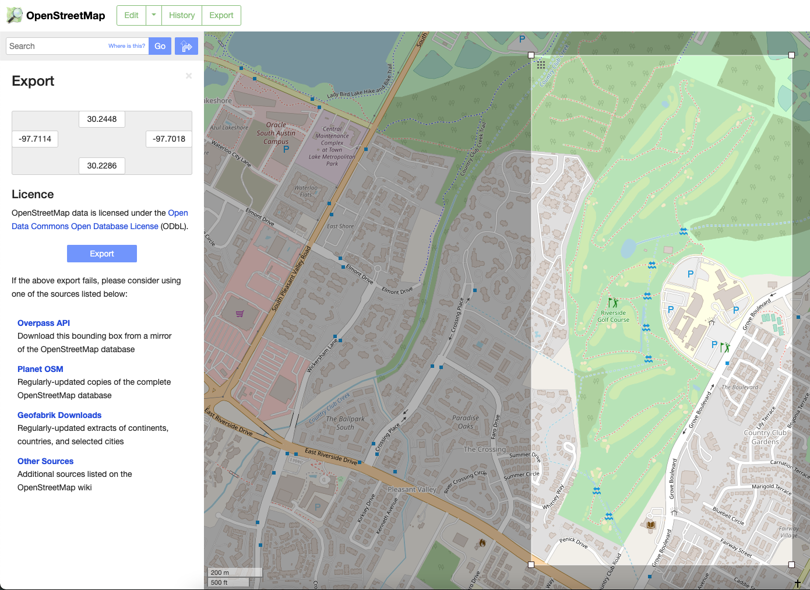
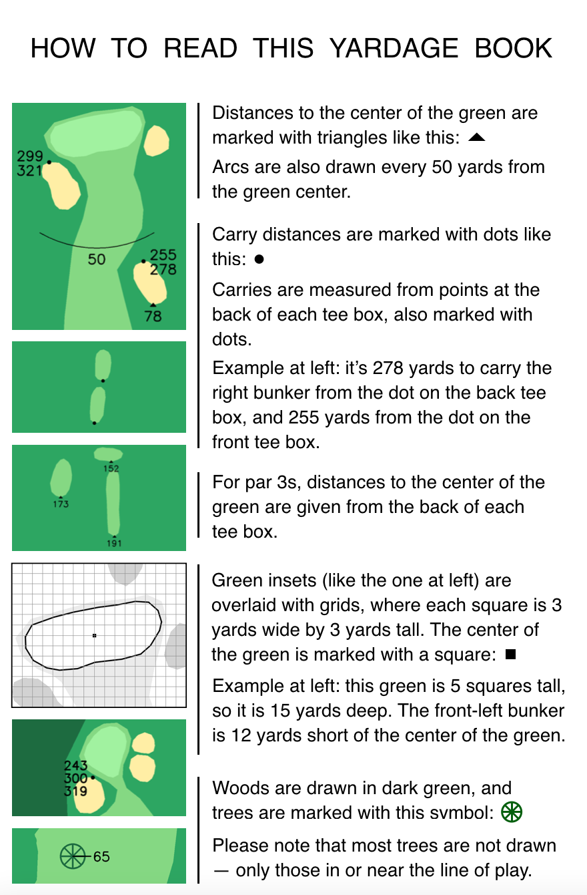

# Hacker Yardage

Thanks for checking out Hacker Yardage! I built this tool because I wanted to make yardage books for some of my favorite golf courses, but it took way too long to draw out each hole and measure all the distances I cared about. Hacker Yardage should make it easy for anyone to create yardage books - see below for step-by-step instructions.

If you use and like the tool, I'd appreciate your support by buying me a coffee. Or, you can check out the merchandise available at https://www.storebrand.golf/.

This project wouldn't be possible without OpenStreetMap - please support them as well.

## Instructions

#### Step 1: get the Hacker Yardage tool running

You will need to have Python 3.6+ installed. You can find downloads from [the official Python website](https://www.python.org/downloads/).  

First, you'll need to download all the files in this repository. You can do that either by running ```git clone https://github.com/elementninety3/hacker-yardage```, or by downloading a zip file from the Github website.

Next, you'll need to install the Python packages listed in ```requirements.txt```. You can do this quite easily by navigating to the project's home folder from the command line and running ```pip install -r requirements.txt```. (If you're running Python 3.6 or later, ```pip``` should be included.)

Once you have all the requirements installed, you can run the tool. From the command line, navigate to the main project folder and run ```python3 hy-app.py``` to use the tkinter app. If you prefer to work with a script rather than the GUI, you can open up ```hy-script.py``` instead.

If you are a true beginner who has never heard of or used Python, don't despair - you should still be able to get the tool running with a little effort. Check out beginner's guides to [Python and the command line](https://opentechschool.github.io/python-beginners/en/index.html) and [pip](https://packaging.python.org/tutorials/installing-packages/).

When you've launched the GUI, you should see something like this:


#### Step 2: map your course on OpenStreetMap

For detailed instructions on how to map courses properly, please see [this guide](docs/howtomap.md).

If you want to skip this step for now and test the tool on a course which has already been mapped, you can use Riverside Golf Course in Austin, TX - the coordinates are included as placeholders in the tool. (I'd suggest testing things out before you spend a lot of time and effort mapping your course.)


#### Step 3: get the coordinates

Once you have your course mapped properly in OpenStreetMap, go to the Export screen.


Click the link that says ```Manually select a different area```. Then, draw a box that covers the entire area of the golf course you want to create a yardage book for. (If you want, you can draw a box around just one or two holes, but it's usually easier to do the whole course at once.)



Then, take the coordinates from OpenStreetMaps and enter them into the Hacker Yardage tool. (If you're using ```hy-script.py``` instead, enter the coordinates from OSM as the variables at the top of the file.)


(If you're using the test coordinates, just type them into the boxes and move on to Step 4.)


#### Step 4: adjust custom options (if desired)

Hacker Yardage lets you customize many parts of the mapping process:

* To change the color of any of the features, replace the hex values on the left side of the screen.

* You can also choose whether you want to overwrite existing output files. (**Warning:** if using this option, make sure you have saved copies of any image files you want to keep somewhere outside of the ```output``` folder.)

* Sometimes, greens or sand traps are close enough to other holes that they also get drawn along with that hole's features (see step 6 for an example of this). Usually, the default settings do a pretty good job for a first run, but if you want, you can adjust the hole width settings on the right side.

(If you're using ```hy-script.py``` instead, all of these options are variables in that file. If you're really into tinkering, you can find all the formulas that do the mapping in ```hyformulas.py``` and tweak or customize them yourself.)

#### Step 5: generate the yardage book

When you're ready, click on the "Generate Yardages" button (or run ```python3 hy-script.py``` from the command line if you're using the script). It may take several minutes to complete the run.

Images will be generated and saved to the ```output``` folder. The image for the first hole will be named ```hole_1.png```, and so on for the rest of the holes. Green inset diagrams for each hole will be saved to the ```greens``` folder.

#### How to read the output

You should have 18 images in the ```output``` folder, one for each hole, with some automatically generated yardages! Here's a guide to reading the output:




#### Step 6: fine-tune your results

After this first run, there might be a couple of holes that need some edits. For example, look at the yardages for Hole 2 at Riverside below - there are some extra tee boxes and one sand trap from another hole included (circled in red). The tee boxes are a particular problem, because the tool thinks they're on this hole, and gives us extra carry distances we don't need. (See the upper-left part of the image.)

<br>

This might not bother you, in which case you can move on. But if you want to fix it, we can clean this up easily.

To re-run just this one hole, first we need to delete ```hole_2.png``` from the output folder:


Then, we need to adjust the hole width settings. I made the hole width narrower (30 yards), and filtered extra-aggressively near the tee box by changing that filter to 40% width. Also, make sure the 'Overwrite existing files?' button is unchecked - otherwise you'll have to wait while the tool redoes every single hole.


Finally, click the ```Generate Yardages``` button one more time. The tool will skip hole 1 and holes 3-18, since there are already images in the ```output``` folder for all of those holes. However, it will re-run hole 2 for us, and the results should look much more accurate:

<br>

## Printing

#### Templates

Once you've got all the imagery generated, you'll probably want to print out a yardage book. To get you started, I've included some templates you can use with legal paper (14" x 11"). These can be found in the ```templates``` folder for both PowerPoint and Keynote.

To use the templates, print double-sided on legal size paper, with the pages set to *flip on the short edge*. If you don't have access to a printer that can print on legal paper, any print store should be able to do it for you.

Next, cut the printed pages in half, using a paper cutter or a straight edge and a utility knife. There are some small marks printed on each page to guide you. Cutting all the pages at once will give the best results, but may be more difficult.

Finally, arrange the strips so that the pages will be in proper order. Fold the book in half using a straight edge, and staple at the seam to make a book! (Tip: I leave my printed books under something heavy for an hour or two to get them flattened out.)

#### Automatically fill the Keynote template on macOS

If you use macOS like me, I've also included an AppleScript that will automatically put the generated images into the Keynote template. You'll still have to go through and fill in the information for each hole, but it should save some time.

To use the script, open up ```templates/Keynote (macOS)/autofill-template.scpt``` and click Run. Select the folders where your hole image files and green image files are, and then choose the template file you want to edit.

Unfortunately I haven't written a macro to do this for the PowerPoint templates - if you want to contribute one, please let me know!
